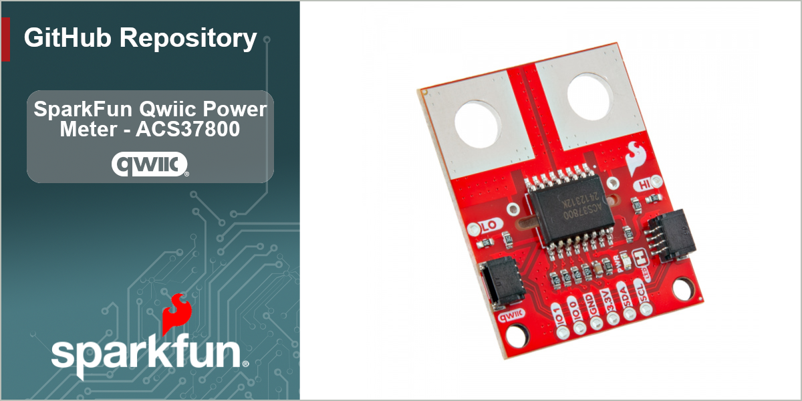

-----------------------------

The SparkFun Qwiic Power Meter - ACS37800 lets you measure voltage up to 60VDC and current up to &plusmn;30A over I2C. This board features the ACS37800 power monitor IC from Allegro Microsystems which uses a hall-effect, galvanically isolated current sensing technology to achieve reinforced isolation ratings on a small board footprint. This breakout integrates the ACS37800 into the Qwiic ecosystem to easily communicate over I2C. 

Although the ACS37800 power monitoring IC is capable of monitoring AC power at high line voltages, the SparkFun Qwiic Power Meter is designed for Safety Extra Low Voltage (SELV) applications of up to 60VDC only. Its use in AC power systems is not recommended.

Repository Contents
-------------------

* **/docs** - Hookup Guide files
* **/Hardware** - Eagle design files (.brd, .sch)
* **/Production** - Production panel files (.brd)

Documentation
--------------
* **[Library](https://github.com/sparkfun/SparkFun_ACS37800_Power_Monitor_Arduino_Library)** - Arduino library for the SparkFun Qwiic Power Meter - ACS37800.
* **[Hookup Guide](https://docs.sparkfun.com/SparkFun_Qwiic_Power_Meter_ACS37800)** - Basic hookup guide for the SparkFun Qwiic Power Meter - ACS37800.

Product Versions
----------------
* [SPX-17873](https://www.sparkfun.com/sparkx-power-meter-acs37800-qwiic.html) - Initial SparkX Release
* [SEN-29259](https://www.sparkfun.com/sparkfun-power-meter-acs37800-qwiic.html) - Initial SparkFun Release

License Information
-------------------

This product is _**open source**_! 

Please review the LICENSE.md file for license information. 

If you have any questions or concerns on licensing, please contact technical support on our [SparkFun forums](https://forum.sparkfun.com/viewforum.php?f=152).

Distributed as-is; no warranty is given.

- Your friends at SparkFun.
