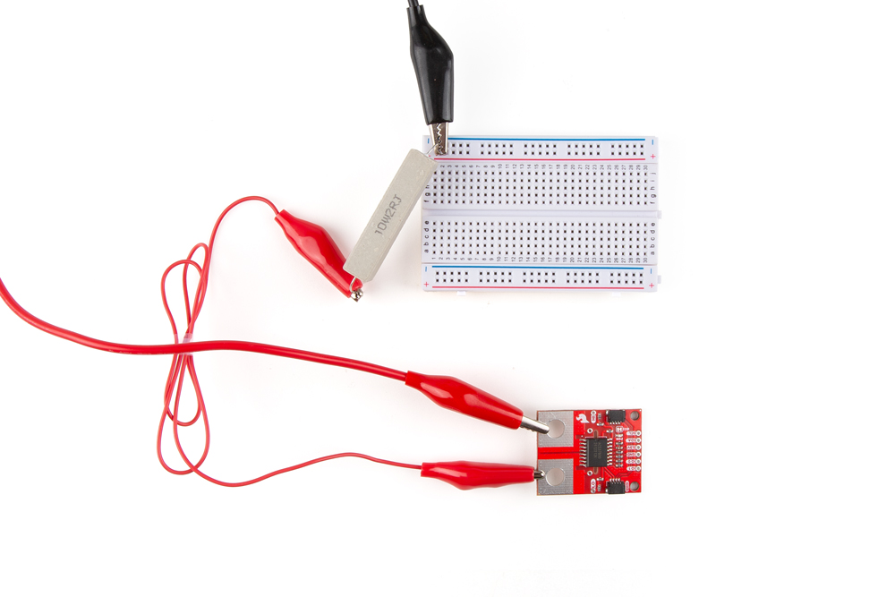
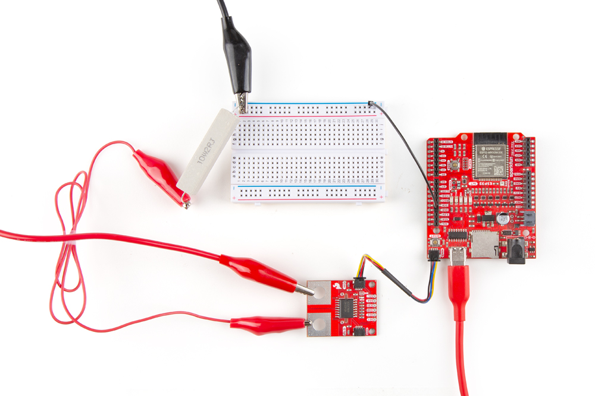
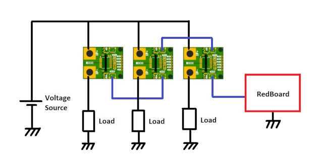
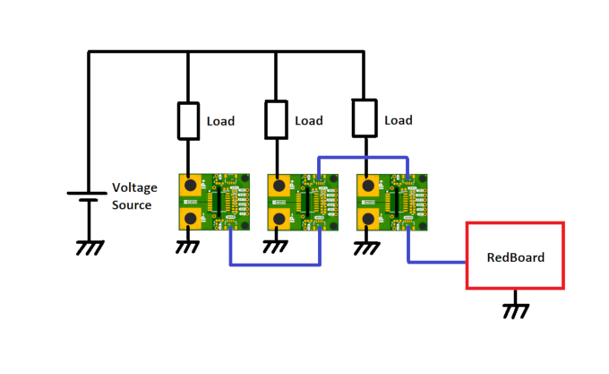

Now that we're familiar with the hardware on the Qwiic Power Meter, let's hook it up in a demo circuit to measure power using a RedBoard IoT - ESP32.

## High-Side Power Measurement

### Load Circuit Assembly

* Start by connecting the the voltage supply's output to the IP+ pin.
* Connect the power resistor or "load" to the IP- pin.
* Connect the other end of the power resistor to the voltage source's ground. In the case of this demo, we've connected the opposite side of the power resistor to the ground rail on our breadboard so we can create a common ground with the RedBoard IoT next.

<figure markdown>
[{ width="600"}](./assets/img/Qwiic_Power_Meter-Load_Assembly.jpg "Click to enlarge")
</figure>

In this configuration, the ACS37800 is able to measure load currents up to +/- 30 Amps. The IP+ and IP- connections are electrically isolated from the rest of the circuit so, to measure voltage (and power), there needs to be a connection from the GND of the Qwiic Power Meter and RedBoard to the GND of the voltage source and load too. That connection is a low current path, only a thin wire is required, but it must be there otherwise the Qwiic Power Meter will not be able to measure voltage (and power).

### Qwiic Assembly

Next we'll connect the Qwiic Power Meter to the RedBoard IoT - ESP32. 

* **Important:** Create a common ground connection by connecting a jumper wire from the breadboard's ground rail to one of the ReBoard IoT's ground pins.
* Connect the two boards together using a Qwiic cable.
* Connect the RedBoard to a computer over USB.

The completed demo circuit should look similar to the photo below:

<figure markdown>
[{ width="600"}](./assets/img/Qwiic_Power_Meter-Completed_Demo_Assembly.jpg "Click to enlarge")
</figure>

## Additional Configuration Diagrams

The above example is just one of several options for power monitoring using the Qwiic Power Meter. The following diagrams give information on wiring several together to monitor multiple devices and how to measure low-side current.

### Parallel Power Monitoring

Since the ACS37800 can be set to any valid I2C address, you can wire multiple Power Meters together to measure several loads. Wiring multiple Qwiic Power Meters in parallel with the voltage source connected to the IP+ on each board with an individual load connected to the IP- pins measures the same voltage across all boards with individual load current and power:

<figure markdown>

</figure>

### Series Power Monitoring

!!! "Important Note"
    Be careful that the Qwiic Power Meter GND connection does not accidentally become a current path which shorts out part of the power circuit. Think very carefully before connecting a jumper wire from GND to an intermediate voltage in a multi-cell, multi-photovoltaic panel or multi-load system. Do not do this:

<figure markdown>
[]
</figure>

### Low-Side Current Measurement

The Qwiic Power Meter can be connected into the low-side of a power circuit too. However, when connected like this, it is only able to measure current, not voltage or power. (Advanced users can: cut the IP+ split-pad jumper link on the rear of the board; and then connect the HI breakout pad to the high side of the load. Consult the [schematic](./assets/board_files/Qwiic_Power_Meter-ACS37800.pdf) and [datasheet](./assets/component_documentation/ACS37800-Datasheet.pdf) for more details.)

<figure markdown>

</figure>