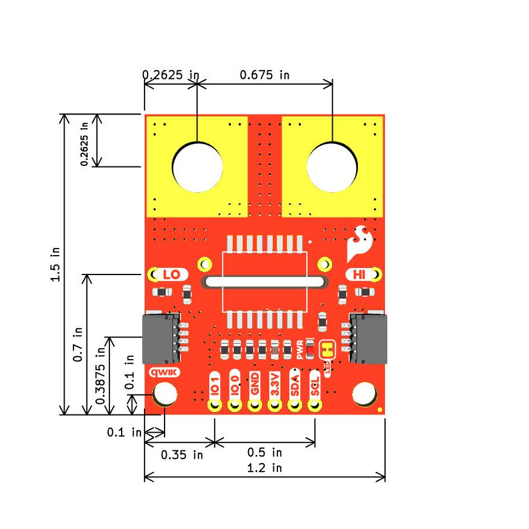

Let's take a closer look at the ACS37800 and the other hardware on the Qwiic Power Meter.

## ACS37800 Power Monitor IC

The ACS37800 power monitor IC from Allegro Microsystems is built around Allegro’s Hall-effect-based, galvanically isolated current sensing technology to achieve reinforced isolation ratings in a small PCB footprint. These features enable isolated current sensing without expensive Rogowski coils, oversized current transformers, isolated operational amplifiers, or the power loss of shunt resistors.

The ACS37800 power monitoring IC offers key power measurement parameters that can easily be accessed through its digital interface. Dedicated and configurable I/O pins for voltage/current zero crossing, undervoltage and overvoltage reporting, and fast overcurrent fault detection are available. User configuration of the IC - including its I2C address - is available through on-chip EEPROM. This breakout uses the <b>3.3V/30A</b> variant that communicates over I2C. Refer to the [datasheet](./assets/component_documentation/) for complete information about the ACS37800.

## Connectors

### Power Monitor Connections

This breakout has two large, isolated connections tied to the ACS37800's IP&plusmn; pins for connecting a voltage supply and load. The board also has smaller PTHs (plated through-holes) just below these large pads connected to IP&plusmn; if needed. 

The board routes the ACS37800's VINP and VINN to two PTHs. The ACS37800 can sense a maximum of &plusmn;250mV between VINP and VINN.

### Qwiic Connectors

The board's two Qwiic connectors route the I2C signals (SDA and SCL) along with 3.3V and Ground to both power the board and let it communicate over I2C.

### PTHs

The 0.1"-spaced PTH header on the bottom of the board routes out the ACS37800's VCC/3.3V, Ground, SDA, SCL and digital I/O pins (0 and 1). Refer to the "Configuring the DIO Pins" section in the [datasheet](./assets/component_documentation/) for more information about using these pins in I2C applications.

## LED

The sole LED on this board is a red Power LED to indicate when the board is powered on.

## Solder Jumpers

The Qwiic Power Meter has four solder jumpers labeled <b>IP+</b>, <b>I2C</b>, <b>LED</b> and <b>VINN</b>. The list below outlines their functionality, default states and notes on how to use them.

* <b>IP+</b> - This jumper connects the IP+ pin to the voltage divider on the board and is CLOSED by default. Opening this jumper isolates the "top" of the resistor divider from the IP+ power pad. Advanced users can open this jumper to measure current on the low side (and voltage from the high side).
* <b>I2C</b> - This three-way jumper pulls the SDA and SCL lines to <b>3.3V</b> through a pair of <b>4.7k&ohm;</b> resistors. It is CLOSED by default. Open the jumper to disable pullups on the I2C bus if necessary.
* <b>LED</b> - This jumper completes the circuit for the red Power LED. It is CLOSED by default. Open this jumper to disable the Power LED.
* <b>VINN</b> - This solder jumper connects the VINN pin to ground and is CLOSED by default. VINN **must** be connected to ground and this jumper should remain closed in most applications.

## Board Dimensions

The Qwiic Power Meter Breakout - ACS37800 is slightly larger than the standard Qwiic breakout and measures 1.2" x 1.5" (30.48mm x 38.10mm) with a pair of mounting holes that fit a 4-40 screw. 

<figure markdown>
[{ width="600"}](./assets/board_files/Qwiic_Power_Meter-ACS37800.jpg)
</figure>