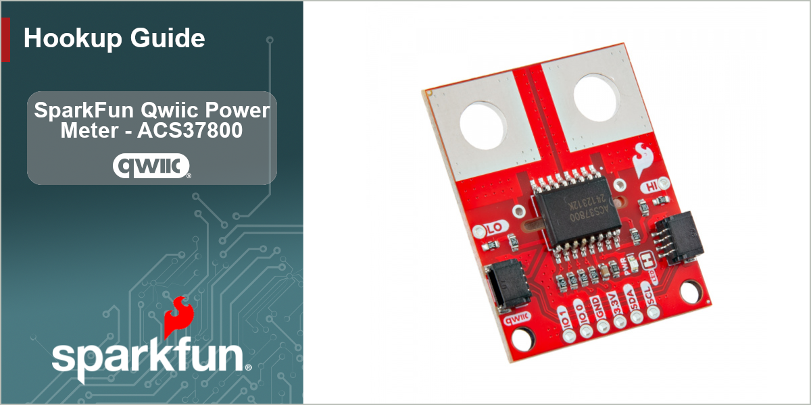

<figure markdown>

</figure>

The SparkFun Qwiic Power Meter - ACS37800 lets you measure voltage up to 60VDC and current up to &plusmn;30A over I2C. This board features the ACS37800 power monitor IC from Allegro Microsystems which uses a hall-effect, galvanically isolated current sensing technology to achieve reinforced isolation ratings on a small board footprint.

In order to follow along with this guide you'll need the SparkFun Qwiic Power Meter along with the following items:

* [SparkFun RedBoard IoT - ESP32](https://www.sparkfun.com/sparkfun-iot-redboard-esp32-development-board.html) (or other Arduino development board)
* [USB-C Cable](https://www.sparkfun.com/usb-a-to-usb-c-cable-1m-usb-2-0-flexible-silicone.html)
* [Qwiic Cable](https://www.sparkfun.com/flexible-qwiic-cable-100mm.html)
* A device to monitor current or voltage.

You'll also need a soldering iron and solder to wire the Qwiic Power Meter to the device you're monitoring. If you need either of those items, we have a selection of them available in our [Soldering category](https://www.sparkfun.com/tools/soldering.html).

## Topics Covered

This document contains three main sections: **Quick Start Guide**, **Hardware** and **Software**.

The Quickstart Guide assumes a working knowledge of how to assemble and use Qwiic breakouts, perform through-hole soldering, measuring current in series and using the Arduino IDE. It demonstrates how to wire up the Qwiic Power Meter to measure current in series and then jumps right into getting the necessary software packages installed to start uploading code in just a few short minutes.

The Hardware pages include a hardware overview that provides a detailed overview of the Qwiic Power Meter - ACS37800 covering all the major components on the board in detail as well as a hardware assembly page which goes over the steps required to assemble and use the board to measure current with a compatible Arduino development board.

The Software pages give instructions on how to install the SparkFun ACS37800 Arduino Library and use some of the examples included in it.

## Resources and Documentation

You'll find the board design files (KiCad files & schematic), relevant documentation (datasheets, white papers, etc.) and other helpful links in the **Resources** tab. Lastly, the **Support** pages include a Troubleshooting page that includes any helpful tips specific to this board as well as information on how to receive technical support from SparkFun.