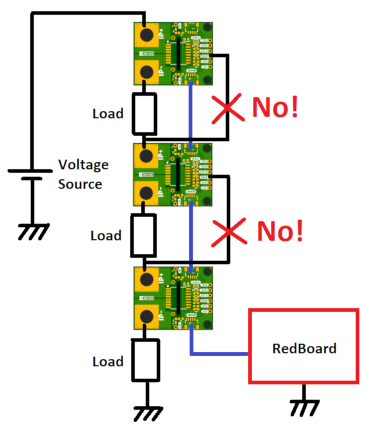

## Safety Information

Although the ACS37800 power monitoring IC is capable of monitoring AC power at high line voltages, the SparkFun Power Meter is designed for Safety Extra Low Voltage (SELV) applications of up to 60VDC only. Its use in AC power systems is not recommended or condoned.

## Wiring Multiple Current Sensors

Be careful that the Qwiic Power Meter GND connection does not accidentally become a current path which shorts out part of the power circuit. Think very carefully before connecting a jumper wire from GND to an intermediate voltage in a multi-cell, multi-photovoltaic panel or multi-load system. Do not do this:

<figure markdown>

</figure>

## General Troubleshooting

!!! note
    
        <strong> Not working as expected and need help? </strong>   

    If you need technical assistance and more information on a product that is not working as you expected, we recommend heading on over to the <a href="https://community.sparkfun.com/">SparkFun Forums</a> to get help from our Technical Support team and community. If this is your first visit, you'll need to create a forum account to search product forums and post questions.  

    
<a href="https://community.sparkfun.com/" class="md-button md-button--primary">Log Into SparkFun Forums</a>
